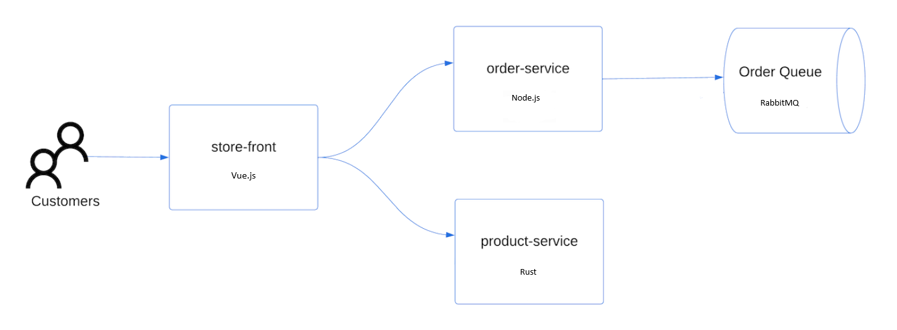

[< Previous: Challenge 02](./Challenge-02.md) | [Next: Challenge 04 >](./Challenge-04.md)

## Deploy a microservice application

### AKS Store application




- Store front: Web application for customers to view products and place orders.
- Product service: Shows product information.
- Order service: Places orders.
- Rabbit MQ: Message queue for an order queue.

Note: Stateful containers such as Rabbit MQ are not recommended without persistent storage for production. Recommend using managed services, such as Azure CosmosDB or Azure Service Bus.

### Deploy the application

Copy the [aks-store-quickstart.yaml](./config/aks-store-quickstart.yaml) file locally and deploy .

Deploy the application using the kubectl apply command and specify the name of your YAML manifest:
```
    kubectl apply -f aks-store-quickstart.yaml
```

The following example output shows the deployments and services:

deployment.apps/rabbitmq created
service/rabbitmq created
deployment.apps/order-service created
service/order-service created
deployment.apps/product-service created
service/product-service created
deployment.apps/store-front created
service/store-front created

When the application runs, a Kubernetes service exposes the application front end to the internet. This process can take a few minutes to complete.


### Check the status of the deployed pods 
Use the kubectl get pods command. Make sure all pods are Running before proceeding.

```
kubectl get pods
```

Check for a public IP address for the store-front application. Monitor progress using the kubectl get service command with the --watch argument.

```
kubectl get service store-front --watch
```

The EXTERNAL-IP output for the store-front service initially shows as pending:
```
NAME          TYPE           CLUSTER-IP    EXTERNAL-IP   PORT(S)        AGE
store-front   LoadBalancer   10.0.100.10   <pending>     80:30025/TCP   4h4m
```
Once the EXTERNAL-IP address changes from pending to an actual public IP address, use CTRL-C to stop the kubectl watch process.

The following example output shows a valid public IP address assigned to the service:
```
NAME          TYPE           CLUSTER-IP    EXTERNAL-IP    PORT(S)        AGE
store-front   LoadBalancer   10.0.100.10   20.62.159.19   80:30025/TCP   4h5m
```

Open a web browser to the external IP address of your service to see the Azure Store app in action.

### Reference
- [Github aks-store-demo](https://github.com/Azure-Samples/aks-store-demo)

- [Quick Start](https://learn.microsoft.com/en-us/azure/aks/learn/quick-kubernetes-deploy-portal?tabs=azure-cli)